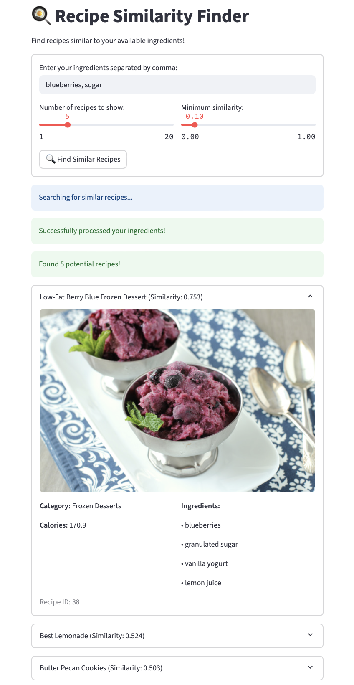
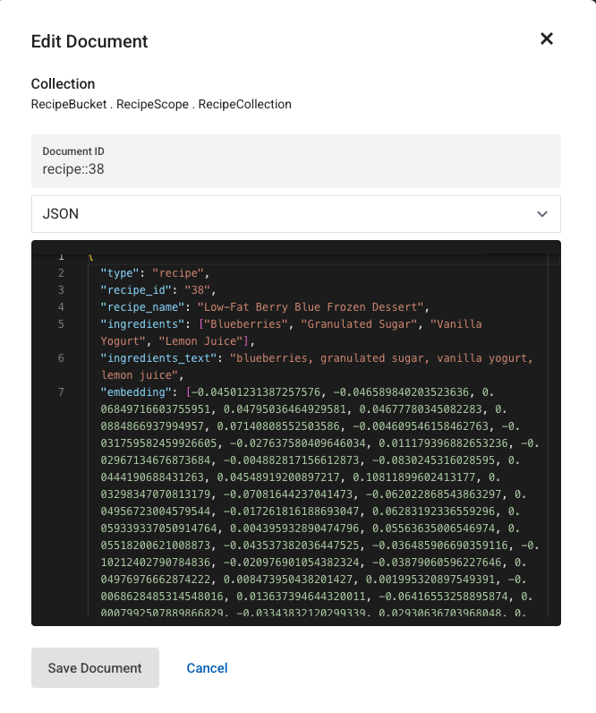

# Recipe Similarity Finder

A Streamlit-based application that helps users find recipes based on ingredients they have at home. The application uses machine learning embeddings and similarity search to match user ingredients with recipes from Food.com and other sources.



## Overview

This application aims to help users enter their ingredients at home and find recipes that can be cooked with those ingredients. The source data is obtained from Kaggle, mainly from Food.com website, which contains detailed recipe information including cooking time, cooking descriptions, calories, and other features.

## How It Works

1. **Input Processing**: Users enter their available ingredients
2. **Data Cleaning**: The application uses Llama3.2:3b model to clean ingredients by removing additional information like cooking methods, quantities, and extra descriptive words
3. **Embedding Generation**: Clean ingredients are converted to vector embeddings using sentence transformers
4. **Similarity Search**: Cosine similarity search is performed between user ingredients and pre-stored recipe embeddings in Couchbase Capella database
5. **Results**: Top matching recipes are displayed with user-defined threshold and number limits

## Architecture

### Part 1: Core Recipe Finder Application

#### Key Components:

- **main.py**: Reads data, calls Llama to clean data, generates embeddings, and prepares data for Couchbase insertion
- **RecipeEmbedding.py**: Loads all-MiniLM-L6-v2 sentence transformer for embedding recipes and user ingredients
- **app.py**: Streamlit frontend application
- **SimilaritySearch.py**: Performs cosine similarity search to find top K similar recipes to user's input

#### To Run Part 1:
```bash
# Start Docker container
bash run.sh
```

Inside the Docker container, run the main.py file to fill the database with the embeddings, all recipes features will be stored, as the example below:



```python
python main.py
```
Now, start the streamlit application by running the command below:

```bash
# Start the app
streamlit run app.py
```

Test the application by entering some ingredents you have, then the most similar recipes will appear in a menu form.

### Part 2: Recipe Data Enrichment

This part is designed to obtain more recipes from https://pinchofyum.com to enrich the current database, as the number of recipes in Food.com can be limited.

#### Key Components:

- **RecipeScraper.py**: Scrapes data from the website using BeautifulSoup
- **RecipeProcessor.py**: Cleans and formats the data, converts it to embeddings and stores the values

#### To Run Part 2:
```bash
# Start Docker container in a new terminal
bash run.sh

# Run the scraper to create pinch_of_yum_recipes.json
python RecipeScraper.py

# Run the cleaning and storing in DB code by

python RecipeProcessing.py

# This creates:
# - pinch_of_yum_recipes.json (raw scraped data)
# - processed_pinch_of_yum_recipes.json (cleaned and formatted recipes)
```

## Features

- **Ingredient-based Recipe Search**: Find recipes based on available ingredients
- **AI-powered Ingredient Cleaning**: Uses Llama3.2:3b to normalize ingredient inputs
- **Semantic Similarity**: Uses sentence transformers for meaningful ingredient matching
- **Adjustable Parameters**: User can set similarity threshold and number of results
- **Rich Recipe Details**: Displays cooking time, calories, instructions, and more
- **Web Scraping**: Ability to enrich database with recipes from additional sources

## Technology Stack

- **Frontend**: Streamlit
- **Database**: Couchbase Capella
- **ML Models**: 
  - Llama3.2:3b (ingredient cleaning)
  - all-MiniLM-L6-v2 (sentence embeddings)
- **Web Scraping**: BeautifulSoup
- **Containerization**: Docker

## Dependencies

```
beautifulsoup4
couchbase
dotenv
huggingface-hub
requests
scikit-learn
sentence-transformers
streamlit
tokenizers
torch
transformers
nest-asyncio
```

## Data Sources

- **Primary**: Food.com dataset from Kaggle
- **Secondary**: Pinch of Yum website (https://pinchofyum.com)

## Getting Started

1. Clone the repository
2. **Download the dataset**: Download the Food.com recipes dataset from Kaggle and place it as `dataset/recipes.csv`
3. Ensure Docker is installed
4. Run `bash run.sh` to start the Docker container
5. Run `python main.py` to clean and store the data from Food.com
6. Execute `streamlit run app.py` inside the container to start the application
7. Access the application at `http://localhost:8501`
8. Run `python RecipeScraper.py` inside the container to scrape data from pinshofyum.com
9. Run `python RecipeProcessing.py` inside the container to clean and store more data in the database

## Usage

1. Enter your available ingredients separated by commas
2. Adjust the number of recipes to show (1-20)
3. Set minimum similarity threshold (0.0-1.0)
4. Click "Find Similar Recipes" to get recommendations
5. Explore recipe details in the expandable sections

## Contributing

1. Create a scraper for the new website to add more recipes
2. Find a way to set a weight for ingredients, for example, in the burger sandwish, the burger has to have higher weight than a slice of tomatos, the current application assumes that all the ingredients have the same level of importance
3. Improve the process and clean functions in the `RecipeProcessing.py` file
4. Fix the order of entering the ingredients, as the current process find the vector embedding with the same exact order of ingredients that the user uses, for example, (sugar, blueberries) will have a slightly different vector embedding than (blueberries, sugar)
4. Fasten the process of obtaining the embeddings by using indexing, or a different similarity search than consine similarity

### Current Limitations & Contribution Opportunities

- **Calories Data**: Currently, calories are not scraped from additional recipe sources (Pinch of Yum). The system generates random calorie values (100-300) for scraped recipes. Adding actual calorie extraction from recipe websites would significantly improve the accuracy and usefulness of the nutritional information displayed to users.

- **Additional Nutritional Information**: Beyond calories, other nutritional data (protein, carbs, fat, vitamins) could be extracted and stored.

- **Recipe Instructions**: While basic instructions are scraped, improving the extraction and formatting of detailed cooking steps would enhance user experience.